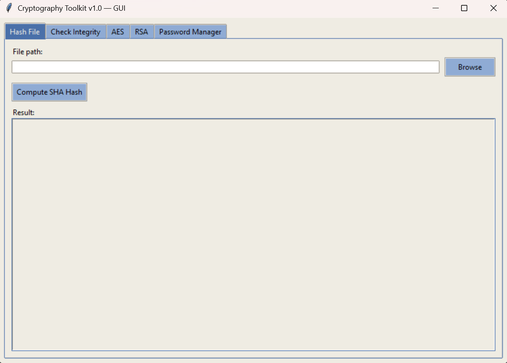

# Cryptografie — Cryptography toolkit v1.0

Small command-line cryptography toolkit that provides file hashing, integrity checks, AES/RSA encrypt/decrypt helpers, and a simple password manager.

## Features

- Hash files (SHA) for integrity checks.
- Compare file integrity (hash comparison).
- AES encrypt/decrypt (prints key, ciphertext, plaintext).
- RSA encrypt/decrypt (prints ciphertext and decrypted plaintext).
- Password strength checking, salting & hashing, and verification.

## Requirements

- Python 3.8 or newer
- Install Python dependencies listed in `requirements.txt`.

### Dependencies

Packages used by the toolkit (see `requirements.txt`):

- `cryptography`
- `zxcvbn`
- `bcrypt`

If `requirements.txt` is missing or you prefer to install manually, the project typically requires libraries for cryptography such as PyCryptodome and a password hashing library. Example fallback:

```powershell
python -m pip install pycryptodome bcrypt
```

## Installation (Windows PowerShell)

Open PowerShell in the project folder (`d:\freecodecamp\cryptografie`) and run:

```powershell
python -m venv .venv
.\.venv\Scripts\Activate.ps1
python -m pip install --upgrade pip
pip install -r requirements.txt
```

This creates and activates a virtual environment and installs required packages.

## Quick Start

Run the CLI (menu-based) or the GUI:

```powershell
# CLI
python main.py

# GUI
python gui.py
```

Tip: If `pip` is not recognized, use `python -m pip` instead.

## Usage

Run the CLI application:

```powershell
python main.py
```

You'll see the interactive menu with options 0–5. Example workflows:

- Hash a file (option 1)
  - Enter the file path when prompted (e.g. `sample_files\sample.txt`).
  - The program prints the SHA hash of the file.

- Check file integrity (option 2)
  - Provide two file paths. The program compares their hashes and reports whether they match.

- AES Encrypt/Decrypt (option 3)
  - Enter a message. The program returns the AES key, ciphertext, and decrypted plaintext.
  - Note: the AES key is printed (for demo purposes) — do not expose keys in production.

- RSA Encrypt/Decrypt (option 4)
  - Enter a message. The script prints encrypted and decrypted results using generated RSA keys.

- Password Manager (option 5)
  - Enter a password to check strength. If strong enough, the program salts & hashes it and asks you to re-enter to verify.

## Examples

Using the sample files bundled with the repo:

```powershell
# Hash a sample file
python main.py
# choose 1
# Enter file path: sample_files\sample.txt
```

## Project Structure

```
cryptografie/
├─ main.py
├─ gui.py
├─ requirements.txt
├─ README.md
├─ LICENSE
├─ sample_files/
│  ├─ sample.txt
│  ├─ sample2.txt
│  ├─ sample3.txt
│  └─ sample4.txt
└─ modules/           # expected next to scripts (hash.py, encryption.py, password.py)
```

## GUI (User-Friendly Interface)

You can also run the graphical UI built with Tkinter. No extra packages are required beyond a standard Python install on Windows.

```powershell
python gui.py
```

The GUI provides tabs for:

- Hash File: Select a file and compute its SHA hash.
- Check Integrity: Select two files and compare their hashes.
- AES: Enter a message to encrypt/decrypt and view key, ciphertext, and plaintext.
- RSA: Enter a message to encrypt/decrypt and view ciphertext and plaintext.
- Password Manager: Check strength, hash the password, then verify by re-entering it.

Note: The GUI imports the same project functions from the `modules` package used by `main.py`. Ensure a `modules/` folder exists alongside `gui.py` and `main.py` containing `hash.py`, `encryption.py`, and `password.py` with the expected functions.

### Screenshot



How to capture on Windows:
- Open the GUI (`python gui.py`), press `Win + Shift + S`, select the window, and paste/save as `docs/gui-screenshot.png`.

## Notes & Security

- This toolkit is intended for learning and small demos only. It prints keys and hashes to the console for visibility.
- Do not use the printed keys or this tool as-is in production systems.
- For production use, securely manage keys (use OS key stores or KMS), never print secrets, and use well-audited libraries and protocols.

## Troubleshooting

- If imports fail, ensure you're inside the virtual environment and `pip install -r requirements.txt` completed successfully.
- If you see `ModuleNotFoundError: No module named 'modules'`, make sure the `modules/` folder is present next to `main.py` and `gui.py`, or adjust `PYTHONPATH` so `from modules ...` resolves.
- On some systems, PowerShell may block script execution. Temporarily allow it for this session:

  ```powershell
  Set-ExecutionPolicy -Scope Process -ExecutionPolicy Bypass
  .\.venv\Scripts\Activate.ps1
  ```

- Use absolute paths if relative paths fail, e.g.: `C:\full\path\to\sample_files\sample.txt`.

## Expected Module APIs

This project expects the following functions in the `modules` package.

From `modules.hash`:

```python
def hash_file(path: str) -> str: ...
def verify_integrity(path1: str, path2: str) -> str | bool: ...
```

From `modules.encryption`:

```python
def aes_ed(message: str) -> tuple[str, str, str]:
  """Returns (key, ciphertext, plaintext)."""

def rsa_ed(message: str) -> tuple[str, str]:
  """Returns (ciphertext, plaintext)."""
```

From `modules.password`:

```python
def check_strength(password: str) -> str: ...   # e.g., "Weak ...", "Strong ..."
def hash_pw(password: str) -> str: ...          # salted/hashed representation
def verify_password(attempt: str, hashed: str) -> bool | str: ...
```

Notes:
- `verify_integrity` and `verify_password` may return a boolean or a message string; both are handled by the CLI/GUI.
- The GUI and CLI treat returned values as strings where appropriate and display them to the user.

## Smoke Tests

A minimal smoke test script is included to exercise each feature quickly. It skips gracefully if the `modules` package isn’t available in this workspace.

Run:

```powershell
python smoke_tests.py
```

The script will:
- Hash `sample_files/sample.txt`.
- Compare file hashes for equality and inequality tests.
- Run AES and RSA encrypt/decrypt round-trips.
- Check a sample password’s strength, then hash and verify it.

## License

This project is licensed under the MIT License — see `LICENSE` for details.